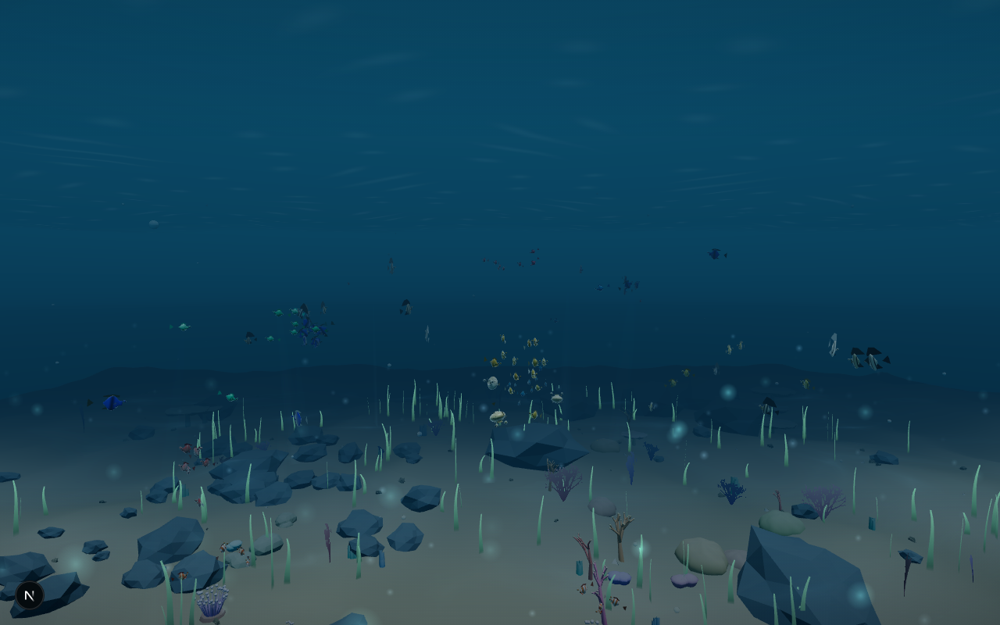

# 🌊 The Living Ocean

> **An ocean that can feel you.** A cinematic, interactive 3D underwater world that responds to your hand movements through your webcam — no controllers, no gloves, just your hand.

<p align="center">
  
</p>

The Living Ocean is a real-time 3D ocean built with **Three.js**, **GSAP** and **MediaPipe Hands**. Raise your webcam hand and the reef reacts: sweep to push a current through the seaweed, open your palm to draw fish closer, close your fist and the reef goes quiet, shove your hand forward to scatter a school in an explosion of bubbles. Everything runs **100% locally in your browser** — camera frames are processed on-device via WASM and are never uploaded or displayed.

---

## ✨ Features

- **Hand-gesture control** — swipe, push, pull, open palm and fist gestures, each with its own force field, animation and sound. Velocity-strength coupling means faster movements hit harder.
- **A living ecosystem** — ~300 fish across 9 procedurally-built species (clownfish, blue tang, angelfish, butterflyfish, Moorish idols, squirrelfish, pufferfish and two silver bait-balls) driven by boids flocking simulation with separation, alignment, cohesion, wander, obstacle avoidance and gesture forces. Bodies are organic swept hulls with a dorsal ridge, compressed flanks and welded smooth normals; fins are true ray fans with membranes and scalloped edges; scales are bump-mapped micro-relief; eyes carry socket, sclera, iris, pupil and glint layers.
- **Feeding frenzy** — press **G** (or the pellets HUD button) to scatter food. Pellets tumble down with water drag and swirl, rest on the seabed, and every school within range breaks formation and races the nearest crumb — the first fish to reach it gulps it down in a shrinking bite.
- **Open-world free swimming** — press **F** (or the waves HUD button) to leave the cinematic drift and explore the whole ocean first-person: drag to look around, turn with **A / D** or the arrow keys, glide with **W / S**, strafe with **Q / E**, rise and sink with Space / C — with soft collision against the seabed and the world edge. With the camera on, your **open palm becomes a swim joystick**: hold it left or right of center to turn, up / down to pitch, and close it into a fist for a forward kick. Touch devices get a hold-to-glide paddle.
- **Four biomes to discover** — the coral gardens of the east, a swaying **kelp forest** in the north-west, a **boulder canyon** with two rock arches in the south-west, shell-bright **sand flats** in the south-east, and towering **monolith spires** on the northern seamount. Each biome has its own sand tint, resident schools and landmarks to navigate by.
- **Special visitors** — a gliding manta ray (broad double-skin wings with a dark back and pale underside, counter-shaded fuselage and a whip tail rooted inside the body), a cruising sea turtle (scute-textured shell, wrinkled mottled skin, tapered paddle flippers that stroke from the shoulder, parrot beak) and three patrolling shark silhouettes (deep-water pass plus two reef crossings) appear on random schedules. Pufferfish are camera-curious and will come say hello.
- **Pufferfish defence display** — when a shark crosses the reef (or you swim right up to one), pufferfish inflate into a ball and their spines extend off the skin in real time — a per-instance shader morph — while the rest of the school panics and scatters around the predator.
- **Procedural reef** — fbm-dune seabed with a canyon basin and seamount, biome-tinted sand, pebbles and shells, 8 procedural coral families, deformed instanced boulders, GPU-swaying seaweed and kelp, starfish, sea urchins and scallop shells — zero external 3D assets.
- **Atmosphere** — animated water surface with Snell-window glow, procedural caustics, volumetric god rays, depth-graded fog, particle plankton, bubble clusters and a fully procedural WebAudio soundscape (drone, water noise, whale calls, gesture shimmer).
- **Projection mapping studio** — turn the ocean into a multi-surface projection system (Resolume-style): spawn 1 → N surfaces (Front / Left / Right walls, floor, ceiling), each with its own virtual camera rendering the **same shared world**, drag 4-corner perspective pins and mesh-warp grids to match real walls, blend and feather overlapping edges, align projectors with calibration patterns (grid, crosshair, color bars, checkerboard, corners), and push a fullscreen, UI-free **OUTPUT** to the projector (Enter / F11-style toggle). Presets: Flat Screen, Cinema Screen, 180° Panorama, 270° Immersive, Immersive Room, Cube Room, Floor + Front. Projects autosave to the browser and export/import as `ocean-projection.project.json`.
- **Cinematic entry** — GSAP-sequenced loading, dive-in descent and staged reveals.
- **Graceful everywhere** — three quality tiers with adaptive degradation, mobile/touch layout, reduced-motion support, and a mouse/keyboard fallback that keeps the ocean alive without a camera.

## 🖐️ Gesture Guide

| Gesture | Action |
|---|---|
| **Sweep hand** left / right / up / down | Sends a current through the water — fish, particles and seaweed follow |
| **Push hand toward camera** | Shockwave that scatters the nearest school |
| **Pull hand back** | Gentle recovery — the reef settles |
| **Open palm (hold)** | Attracts nearby fish and plankton |
| **Closed fist (hold)** | Caution mode — fish keep their distance |

### Mouse / Touch / Keyboard fallback

| Input | Action |
|---|---|
| Move / drag the pointer | Directs the ambient current |
| Tap / click | Attract burst |
| Press & hold | Push shockwave |
| `W A S D` / arrows | Swim the current around |
| `Space` | Continuous push |
| `X` | Scatter pulse |
| `G` / pellets HUD button | Scatter food — schools race in to eat |

### Free-swim exploration (`F`)

| Input | Action |
|---|---|
| `F` / waves HUD button | Toggle free swim |
| Drag (mouse or touch) | Look around |
| `W` / `S` or `↑` / `↓` | Glide forward / back |
| `A` / `D` or `←` / `→` | **Turn left / right** |
| `Q` / `E` | Strafe left / right |
| `Space` / `C` or `Shift` | Ascend / descend |
| **Open palm** (camera on) | Steers: left / right of center turns, up / down pitches |
| **Fist** (camera on) | Forward fin-kick burst |
| `▲ GLIDE` paddle (touch) | Hold to swim forward |
| `Esc` | Return to the cinematic drift |

## 🎛️ Projection Mapping Studio

Open the projector HUD button (or press the studio button top-right of the HUD) to turn the ocean into a **multi-surface projection system**. Every surface is a slice of the projector canvas driven by its own virtual camera — and all cameras render the **one shared 3D world**, so fish swim continuously from wall to wall to floor without a cut.

**Operator workflow:**

```text
1. Pick a preset        Flat Screen · Cinema · 180° · 270° Immersive · Immersive Room · Cube Room · Floor+Front
2. Match your room      drag corner nodes in the OUTPUT tab (true perspective corner pin)
3. Refine               raise WARP grid resolution and push interior nodes (mesh warp)
4. Camera               set position / yaw / pitch / FOV per surface, or snap FRONT·LEFT·RIGHT·FLOOR·CEILING
5. Blend                feather left/right/top/bottom edges where projectors overlap
6. Calibrate            grid / crosshair / color bars / checkerboard / white / black / corner labels
7. Preview              multi-camera view (SINGLE · 2×2 · ALL) + live per-camera previews
8. Project              OUTPUT (or Enter) → fullscreen UI-free composite; Esc returns to the studio
```

- **Surfaces rack** — add, duplicate, rename, reorder, lock, enable/disable; selection drives the properties panel and the node editor.
- **Node editor** — drag corners or mesh nodes with snap-to-grid and numeric X/Y readout; undo/redo (`Ctrl+Z` / `Ctrl+Shift+Z`); `Delete` removes the selected surface.
- **Blend** — per-surface opacity, brightness, gamma, feather and normal/add/screen blend modes. These grade the projection only — the source world is never altered.
- **Output quality (hardware-sized)** — pick how sharp the projection is: **AUTO** (measures live frame cost and tunes itself between ~30% and 95%), **PERFORMANCE** (weak GPUs / many surfaces), **BALANCED** (laptops), **HIGH** (desktop GPUs, 0.8× + 2× AA), **ULTRA** (1:1 pixels, 4096 px ceiling, 4× MSAA), or **CUSTOM** (manual 10–100% scale). Named in the PROJECT tab and on the `/output` overlay; the choice is saved with the project. Per-surface RTs are additionally clamped by the GPU's max texture size.
- **Output sessions — shareable links** — publish the current setup under a name in **PROJECT → OUTPUT SESSIONS** and it gets a permanent **`/output?s=<id>`** URL. The link boots with exactly those settings (surfaces, cameras, warp, blend, quality, canvas) and **keeps running even with the studio closed** — and while the studio is open the same link **live-follows every edit** (surfaces, warp, quality, canvas), so the projector always shows the operator's full current settings; the session's stored snapshot is refreshed by those pushes too, so reopening the link later boots the newest state, no republish needed. Publishing again with the same name updates that link in place; a new name creates a new session. **COPY LINK** puts the URL on the clipboard, **LOAD** restores the session into the studio for continued editing, and the `/output` overlay's **SESSION** menu switches between published shows in place.
- **Free output canvas + ratios** — the master canvas is no longer limited to presets: set **CANVAS W/H** directly and snap to **16:9 / 32:9 / 4:3 / 1:1**. Each slice has **SLICE RATIO** quick-sets and a **Lock** that keeps its aspect while resizing (Resolume-style), and a locked camera shows its angular ratio with a **MATCH SLICE** button that reshapes SPAN V so the frustum ratio equals the slice ratio — no stretched pixels. The house rule everywhere: room cameras stay span-locked (edges connect wall-to-wall), and new surfaces are born span-locked too.
- **Projects** — autosaved to the browser (every edit, including corner drags and numeric fields, persists within a second so `/output` always matches what you set); **EXPORT / IMPORT** writes `ocean-projection.project.json` (version, output config, every surface with camera, warp grid, blend and calibration state).

### Dedicated output page — `/output`

For real installs, open **`/output`** on the projector machine (or a second window/display): it boots a **clean, UI-free feed** — nothing but the picture, rendered from the saved projection config.

- **Live sync** — with the studio open in another tab of the same browser, every edit (corner drags, mesh nodes, surface moves in the output editor, presets, blend, quality, canvas size, resolution) is pushed to `/output` within ~300 ms (BroadcastChannel, independent of the autosave) — including session-linked tabs, which show **LIVE LINK** in the readout while they follow the studio. With the control closed the page keeps running its last state (a `?s=` link re-boots from its published snapshot), and `IMPORT .JSON` loads a project file on any machine.
- **Operator settings in place** — move the mouse and a small overlay fades in: **QUALITY** (Auto / Performance / Balanced / High / Ultra — saved into the project and synced back to the show), **PATTERN** (show/hide grid · crosshair · color bars · checkerboard · white · black · corners for alignment — set back to OFF for the show), **FULLSCREEN**, **IMPORT .JSON** and a live surface/resolution readout (active quality + per-surface source pixels). It hides itself (and the cursor) after a moment, so the projection stays clean. `?pattern=grid` starts pre-calibrated.
- **Seamless edges (span lock)** — room presets derive every camera's frustum from the world angles its wall covers (shared eye point + 90°×90° spans for right-angle rooms). Adjacent frustum edges meet **exactly**, so the frame is never cut or duplicated between walls; floor wedges continue walls at the matching pitch. Toggle it per surface via **“Match wall edges (span lock)”** in the properties panel (SPAN H / SPAN V sliders).

## 🚀 Quick Start

```bash
# 1. clone
git clone https://github.com/Muh-Adib/ocean-camera.git
cd ocean-camera

# 2. install
npm install        # or: bun install

# 3. run
npm run dev        # http://localhost:3000

# 4. production
npm run build
npm start
```

> **Requirements:** Node.js 18+ (or Bun). A webcam is optional — the experience boots straight into mouse mode if you skip the camera prompt.

## 📷 Camera Troubleshooting

The experience never shows raw browser errors — it diagnoses camera problems and tells you exactly how to fix them:

| On-screen message | Cause & fix |
|---|---|
| **CAMERA BLOCKED BY THE PREVIEW** | You're viewing the page inside an embedded iframe (preview pane) that forbids camera access. Use the **OPEN IN NEW TAB** button, then allow the camera there. |
| **CAMERA PERMISSION NEEDED** | The browser prompt was denied. Click the padlock icon in the address bar → allow Camera → **TRY AGAIN**. |
| **NO CAMERA FOUND** | No camera hardware detected, or it's disabled in system settings. |
| **CAMERA IN USE** | Another app (Zoom, Meet, OBS…) is holding the camera. Close it and retry. |
| **SECURE CONNECTION NEEDED** | `getUserMedia` requires HTTPS or `localhost`. Serve the page securely. |
| **HAND MODEL NOT LOADED** | The MediaPipe hand model couldn't be fetched (network hiccup). Wait a moment and **TRY AGAIN**. Model loading is time-boxed, so the button never spins forever. |
| **CAMERA DISCONNECTED** | The camera vanished mid-session — unplugged, switched off, or permission revoked. Reconnect and retry. |

Hand tracking also degrades gracefully: **GPU inference falls back to CPU** automatically on devices whose drivers reject WebGL delegates.

## 🧱 Tech Stack

| Layer | Tool |
|---|---|
| 3D rendering | [Three.js](https://threejs.org) (WebGL, InstancedMesh, custom shaders) |
| Animation / sequencing | [GSAP](https://gsap.com) |
| Hand tracking | [MediaPipe Hand Landmarker](https://ai.google.dev/edge/mediapipe/solutions/vision/hand_landmarker) — bundled locally (npm JS + `/public/mediapipe` WASM & model), WASM inference on-device, **zero CDN** |
| Framework | [Next.js](https://nextjs.org) (App Router) — React only mounts the container; the entire experience is framework-free TypeScript in `src/experience/` |
| Audio | Procedural WebAudio (no audio files) |

## 📁 Project Structure

```
src/experience/
├── core/          SceneManager, CameraRig, Lighting, PerformanceManager, sharedUniforms
├── environment/   Seabed, Rocks, CoralSystem, Seaweed, WaterSurface, ReefDecor, Biomes (kelp forest · rock arches · spires)
├── particles/     ParticleField, Bubbles, GestureBurst
├── fish/          FishGeometryFactory (procedural species), Boids, FishManager, SpecialCreatures
├── interaction/   HandTracker, GestureEngine, InteractionField, PointerFallback, SwimController
├── projection/    ProjectionManager, SurfaceManager, CameraManager, WarpMath, OutputManager (RT compositing), BlendManager, CalibrationManager, ProjectManager, Editor UI + node editor
├── audio/         AudioManager (procedural WebAudio)
├── ui/            UI (intro, HUD, guide, toasts, camera help), GestureView
└── utils/         math helpers
```

## ⚡ Performance & Accessibility

- **Three quality tiers** detected at boot (mobile / integrated / discrete GPU) controlling pixel ratio, particle counts, coral density, light-ray count and fish population — with live adaptive degradation if the frame rate dips.
- **One instanced draw call per school** keeps the whole reef in ~20 draw calls.
- Honors `prefers-reduced-motion`: intro descent and drift are dampened.
- Safe-area aware HUD for notched phones.

## 🔒 Privacy

- Camera frames are processed **entirely on-device** via WASM.
- The whole tracking engine is served with the app — no CDN requests, so hand tracking keeps working offline and on restricted networks.
- The video element is never rendered to the page — nothing is recorded, stored or uploaded.
- Only derived, anonymous hand geometry (palm position, openness, scale) is used, and only to drive forces inside the scene.

## 📄 License

Released under the [MIT License](LICENSE) — © 2026 Muh-Adib.
